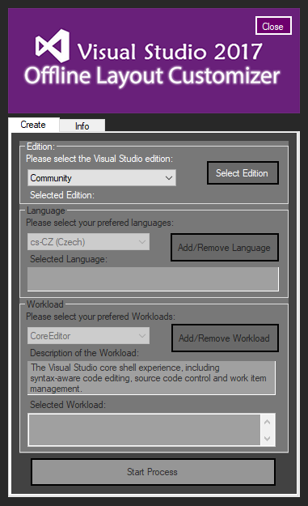

# :large_blue_diamond: Visual Studio 2017 Offline Layout Customizer

> **When you need something but you can't find it... _JUST CREATE IT_** :shipit:

## :large_orange_diamond: Video Preview
https://www.youtube.com/embed/sy6ew3UEexw

## :large_orange_diamond: Description
A simple GUI tool to create your own Visual Studio 2017 offline installation.

## :large_orange_diamond: Features
- Auto-download requires files (Visual Studio Edition .exe from official MS download link)
- Create your own offline Layout choosing Language and Workload
- Check for Update

## :large_orange_diamond: TO-DO :scream:
- [x] Basic Function
- [x] Better GUI
- [x] Update Layout

## :large_orange_diamond: License :copyright:
[This Project is under GNU GPLv3]

## :large_orange_diamond: Legal :warning:
This is a full Open Source software. You can fork and do your modification but at least keep the credits!
